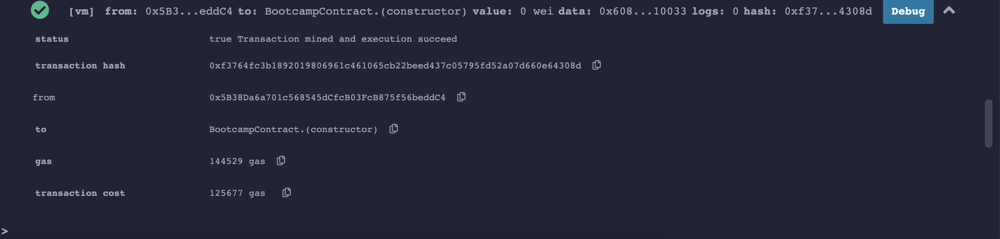

# Encode Solidity Bootcamp

## Homework - Day 2

1. Using a blockchain explorer, have a look at the following transactions, what do they do?

 i 0x0ec3f2488a93839524add10ea229e773f6bc891b4eb4794c3337d4495263790b
 ii. 0x4fc1580e7f66c58b7c26881cce0aab9c3509afe6e507527f30566fbf8039bcd0
 iii. 0x552bc0322d78c5648c5efa21d2daa2d0f14901ad4b15531f1ab5bbe5674de34f
 iv. 0x7a026bf79b36580bf7ef174711a3de823ff3c93c65304c3acc0323c77d62d0ed
 v. 0x814e6a21c8eb34b62a05c1d0b14ee932873c62ef3c8575dc49bcf12004714eda

2. What is the largest account balance you can find ?

3. What is special about these accounts :

 i. 0x1db3439a222c519ab44bb1144fc28167b4fa6ee6
 ii. 0x000000000000000000000000000000000000dEaD

4. 1. Using remix add this contract as a source file

 i. Compile the contract
 ii. Deploy the contract to the Remix VM environment

1. 
    1. Interacts with 'The DAO' contract.
    2. Internal Swap in Uniswap.
    3. & iv. Seem to be an exploit of a contract, apparently the massive hack that happened to Binance.
    5. Another compromised wallet that interacted with the exploit of the Polygon Network.

This information seems to indicate how hackers have breached the security and compromised the assets of walllets and keys from other participants of the blockchain.

2. Largest account balance is in the 4th and 5th tx wallet, holding 1.45 Eth.

3. Both addresses belong to Vitalik Butterin.

4. 

